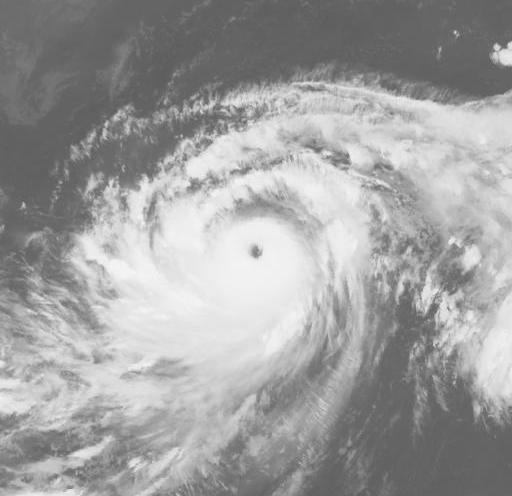

# Western Pacific Typhoon trajetories prediction

#### Predicting the Western Pacific Region tropical cyclones trajectories using various Deep Learning Approaches
``` 
All details can be found at Thesis.pdf. 
The report outlines project motivations, model implementation methodologies and results details.
```

### General description: 

This project proposed different deep learning frameworks on real historical typhoon data extracted from the NOAA archive and the Kitamoto laboratory data repository. Various deep learning approaches were conducted to predict the next 3 hours and 6 hours of typhoon tracks in the Western Pacific Region. The experimental result showed that the LSTM regression model and the CNN-LSTM ensemble model delivered a similar prediction result toward the 3-hour prediction, however, the CNN-LSTM ensemble model performed better on 6 hours prediction compared to other deep learning approaches conducted in this project. The CNN-LSTM ensemble model could be a potential deep learning approach to deliver a more robust prediction result if diverse image data type was used to extract relevant track feature in the model.


### Summary (last update: July 2022)
#### Deep learning framework: Pytorch

#### 1. Meteorological data: 
```
Latitude 
Longitude 
Distance to Land 
Wind
Pressure
Radius of maximum wind in 34 miles (NE), Radius of maximum wind in 34 miles (SE), 
Radius of maximum wind in 34 miles (SW), Radius of maximum wind in 34 miles (NW), 
Radius of maximum wind in 50 miles (NE), Radius of maximum wind in 50 miles (SE), 
Radius of maximum wind in 50 miles (SW), Radius of maximum wind in 50 miles (NW), 
Radius of maximum wind in 64 miles (NE), Radius of maximum wind in 64 miles (SE), 
Radius of maximum wind in 64 miles (SW), Radius of maximum wind in 64 miles (NW) 
```

#### 2. Image Data

<p align=""></p>

one of the satellite image example for training in a CNN-LSTM model

#### 3. Model architecture


3.1 LSTM Regression model

<p align=""></p>


3.2 CNN-LSTM ensemble model


<p align=""></p>


3.3 LSTM Classification model


<p align=""></p>


### Model comparison on RMSE 3 hours and 6 hours track error 

<p align=""></p>

### One of the examples of visulaising 3 hours track prediction on Supertyphoon Manghkurt from CNN-LSTM ensemble model

<p align="center"></p>

### One of the examples of visulaising 6 hours track prediction on Supertyphoon Manghkurt from CNN-LSTM ensemble model

<p align="center"></p>

### Numerical Data (17 meteorological features)
Full WP dataset.csv is provided in this respository. Original csv file can be downloaded from the NOAA data archive.

### Image Data for extracing image features from pretrained Resnet18 CNN model
A python file ie.Typhoon_image_scrapping_tool.py is provided in this respository. It might take days to scrap all satelite images from the website. ie Depends how many images you want to scrap.
